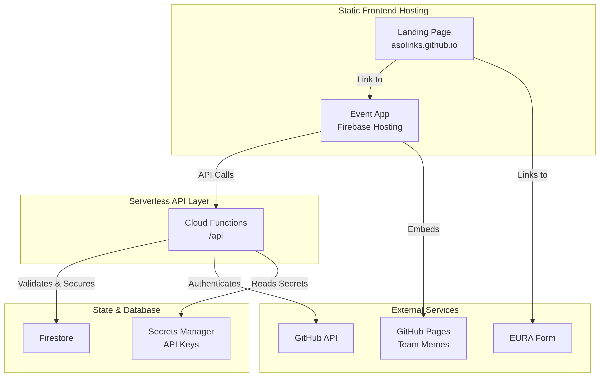

# 🚀 ICT Oulu 2025 - Get Gitty Meme Wars

Welcome to the official landing page for the **Get Gitty Meme Wars**, a fun and competitive workshop hosted by **ITEE - ICT Oulu (IKAPO)**.  
This page serves as the gateway to a day of creativity, coding, and friendly competition.

---

## 🌐 Live Site
[https://asolinks.github.io/](https://asolinks.github.io/) *(or your custom domain)*

---

## 🎯 Purpose
This landing page is designed to:

- Provide information about the ICT Oulu 2025 workshop.  
- Direct participants to the main event platform.  
- Showcase the organizations that made the event possible.  


---

## 🏗️ Architecture Overview
The **Get Gitty Meme Wars** platform is a **full-stack application** built on a modern, serverless **JAMstack** architecture for scalability, security, and performance.  
The system is composed of a static frontend and a secure API backend that mediates all access to the database.

### Diagram


### Key Components Explained
- **Landing Page (asolinks.github.io):** A simple, static HTML/CSS page (this repo). It acts as a brochure and entry point.  
- **Event App (Firebase Hosting):** The main competition website (`event.html`). A dynamic SPA that handles registration, voting, and live leaderboards.  
- **Cloud Functions API:** The secure brain of the operation. All actions (registration, voting, admin commands) go through this serverless API. It enforces security and business logic.  
- **Firestore Database:** The single source of truth. Stores team data, votes, and competition state. No client-side writes are allowed; all access is mediated by the API.  
- **GitHub Pages:** Where the memes are hosted. Each team forks a template repo and hosts their meme. The main app embeds these via iframes.  
- **Secrets Manager:** Securely stores API keys and passwords (Admin secret, GitHub token) outside of the codebase.  

---

## 🛠️ Technology Stack
| Component              | Technology                                    |
|-------------------------|-----------------------------------------------|
| **Frontend (Landing)**  | Vanilla HTML, CSS                             |
| **Frontend (Event)**    | Vanilla JavaScript, HTML, CSS                 |
| **Backend API**         | Node.js, Express.js, Firebase Cloud Functions v2 |
| **Database**            | Firebase Firestore (NoSQL)                   |
| **Hosting**             | GitHub Pages (Landing), Firebase Hosting (Event) |
| **Authentication**      | Firebase Secrets Manager, Hashed Client Fingerprinting |
| **Meme Hosting**        | GitHub Pages (via team forks)                 |

---

## ✨ Features
- **Team Registration:** Secure, server-side registration that generates custom GitHub repo names.  
- **Live Voting:** Real-time voting system with duplicate prevention via IP+User-Agent fingerprinting.  
- **Admin Controls:** Secure dashboard for organizers to start, pause, or end the event.  
- **Automated Meme Discovery:** Backend process that automatically finds and displays submitted memes.  
- **Real-time Leaderboard:** Live-updating leaderboard that ranks teams by votes.  
- **Interactive Quizzes:** Fun client-side quizzes (Git Quiz, Career Path Discovery) to engage participants.  

---

## 🔧 For Developers: Setup & Deployment
This repository is **static**. To update the landing page:

1. Clone the repository:
   ```bash
   git clone https://github.com/asolinks/ikapo.git
   ```

2. Make your changes to `index.html` or `index.css`.  

3. Commit and push changes to the main branch:
   ```bash
   git add .
   git commit -m "Update landing page copy"
   git push origin main
   ```

GitHub Pages will automatically deploy changes from the `main` branch.  
No build step is required.

👉 Note: The main event application is hosted separately on **Firebase**. Its code is located in `event.html`, `app.js`, and `styles.css` in the main project repo.

---

## 📋 Pre-Workshop Checklist
- ✅ Ensure the Template Repository (`meme-wars-template`) is configured and its README is clear.  
- ✅ Verify all **Cloud Functions** are deployed and secrets (`ADMIN_SECRET`, `HASH_SALT`, `GITHUB_TOKEN`) are set.  
- ✅ Test the end-to-end flow: register a test team, fork the template, push a meme, and confirm it appears on the site.  
- ✅ Confirm the **landing page** (this site) is live and links are correct.  

---

## 👥 Contributors
This workshop is made possible by the **IKAPO Project** community and our fantastic funders.  

---

## 📄 License
This project is for **educational and workshop purposes** as part of ICT Oulu 2025.  

🎉 Happy coding and may the best meme win! 🏆
